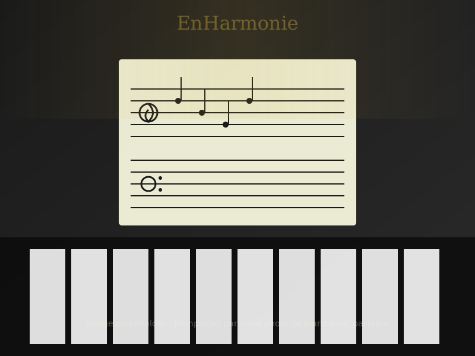

# 🚀 Démarrage Rapide - EnHarmonie

**Vous voulez voir le site immédiatement ? Suivez ce guide !**

---

## ⚡ En 3 minutes

### Étape 1 : Ouvrir le terminal

**Sur macOS :**
- Appuyez sur `Cmd + Espace`
- Tapez "Terminal"
- Appuyez sur `Entrée`

### Étape 2 : Naviguer vers le projet

```bash
cd "/Users/admin/DEV AGENCY/DEV/EnHarmonie/EnHarmonie-main"
```

### Étape 3 : Lancer le serveur

**Option A - Script automatique (recommandé) :**
```bash
./test-local.sh
```

**Option B - Python manuel :**
```bash
python3 -m http.server 8000
```

### Étape 4 : Ouvrir dans le navigateur

Le site s'ouvrira automatiquement, sinon allez sur :
```
http://localhost:8000
```

🎉 **C'est fait ! Le site est visible.**

---

## 📱 Tester sur mobile

### Méthode 1 : Mode responsive du navigateur

1. Appuyez sur `F12` (ou `Cmd + Option + I` sur Mac)
2. Cliquez sur l'icône mobile/tablette 📱
3. Sélectionnez un appareil (iPhone, iPad, etc.)

### Méthode 2 : Sur votre vrai téléphone

1. Trouvez l'IP de votre ordinateur :
```bash
# Sur Mac
ifconfig | grep "inet " | grep -v 127.0.0.1
```

2. Sur votre téléphone (même WiFi), allez sur :
```
http://VOTRE_IP:8000
```

---

## 🎨 Personnaliser rapidement

### Changer les couleurs

Ouvrez `css/styles.css` et modifiez les lignes 6-17 :

```css
:root {
    --color-gold: #d4af37;    /* Changez l'or */
    --color-dark: #0a0a0a;    /* Changez le noir */
    /* ... */
}
```

Rechargez la page (`Cmd + R`) pour voir les changements.

### Modifier les textes

Ouvrez `index.html` dans votre éditeur de code et modifiez directement les textes.

**Exemples de sections :**
- **Hero** : ligne ~21
- **À propos** : ligne ~60
- **Tarifs** : ligne ~200
- **Contact** : ligne ~435

### Changer les tarifs

Dans `index.html`, cherchez (Cmd+F) "35€" et modifiez :

```html
<div class="price">
    <span class="amount">35€</span>  <!-- Changez ici -->
    <span class="period">/ heure TTC</span>
</div>
```

---

## 📸 Remplacer les images

### 1. Préparez vos images

**Noms requis :**
- `piano-keys.jpg` - Photo de touches de piano (1920x1080px)
- `piano-sheet.jpg` - Piano avec partition (800x600px)

**Optimisez-les :**
- Sur [TinyPNG.com](https://tinypng.com/)
- Ou [Squoosh.app](https://squoosh.app/)
- Objectif : < 500 KB chacune

### 2. Placez-les

```bash
# Copiez vos images dans le dossier
cp ~/Downloads/piano-keys.jpg images/
cp ~/Downloads/piano-sheet.jpg images/
```

### 3. Mettez à jour le code

**Dans `index.html` ligne ~21 :**
```html
<!-- Remplacez ceci : -->
<header id="hero" class="hero" style="background-image: url('images/piano-keys-placeholder.svg');">

<!-- Par ceci : -->
<header id="hero" class="hero" style="background-image: url('images/piano-keys.jpg');">
```

**Dans `index.html` ligne ~115 :**
```html
<!-- Remplacez ceci : -->


<!-- Par ceci : -->

```

**Dans `css/styles.css` ligne ~150 :**
```css
/* Remplacez ceci : */
background: url('../images/piano-keys-placeholder.svg') center/cover no-repeat;

/* Par ceci : */
background: url('../images/piano-keys.jpg') center/cover no-repeat;
```

---

## 📧 Configurer le formulaire (5 min)

### Option la plus simple : Formspree

1. Allez sur [formspree.io](https://formspree.io/)
2. Créez un compte (gratuit)
3. Créez un nouveau formulaire
4. Copiez votre ID de formulaire

Dans `index.html`, ligne ~420, remplacez :
```html
<form class="contact-form" data-aos="fade-left" id="contactForm">
```

Par :
```html
<form class="contact-form" action="https://formspree.io/f/VOTRE_ID" method="POST">
```

**C'est tout ! Le formulaire fonctionne.**

---

## 🚀 Mettre en ligne (10 min)

### La méthode la plus simple : Netlify

1. **Allez sur [netlify.com](https://www.netlify.com/)**
2. **Créez un compte** (gratuit)
3. **Glissez-déposez** votre dossier `EnHarmonie-main`
4. **Attendez 30 secondes**

🎉 **Votre site est en ligne avec HTTPS !**

Netlify vous donne une URL type : `https://nom-aleatoire.netlify.app`

**Bonus :** Vous pouvez connecter votre propre domaine gratuitement.

---

## 🔧 Problèmes courants

### Le serveur ne démarre pas

**Erreur : "command not found: python3"**

Essayez :
```bash
python -m SimpleHTTPServer 8000
```

Ou :
```bash
php -S localhost:8000
```

Ou ouvrez simplement `index.html` en double-cliquant dessus.

### Les images ne s'affichent pas

- Vérifiez que les fichiers existent dans `images/`
- Vérifiez les noms (sensible à la casse)
- Videz le cache : `Cmd + Shift + R`

### Le formulaire ne s'envoie pas

C'est normal ! Il faut d'abord le configurer (voir section ci-dessus).

### Le site est cassé sur mobile

Appuyez sur `F12` → onglet Console pour voir les erreurs.

---

## 📚 Documentation complète

Ce guide est un démarrage rapide. Pour plus de détails :

| Document | Quand l'utiliser |
|----------|------------------|
| [README.md](README.md) | Vue d'ensemble du projet |
| [INSTALLATION.md](INSTALLATION.md) | Installation détaillée |
| [DEPLOIEMENT.md](DEPLOIEMENT.md) | Mise en ligne complète |
| [TESTS.md](TESTS.md) | Tester avant production |
| [AMELIORATIONS.md](AMELIORATIONS.md) | Évolutions futures |
| [LIVRAISON.md](LIVRAISON.md) | Récapitulatif technique |

---

## ✅ Checklist rapide avant mise en ligne

- [ ] J'ai testé le site en local
- [ ] J'ai remplacé les images placeholder
- [ ] J'ai mis à jour les coordonnées (email, tél)
- [ ] J'ai configuré le formulaire de contact
- [ ] J'ai vérifié les tarifs
- [ ] J'ai testé sur mobile
- [ ] J'ai testé le formulaire
- [ ] Tout fonctionne correctement

**Si tout est coché → Vous pouvez déployer ! 🚀**

---

## 💡 Astuces pro

### Éditer le code facilement

**VS Code (recommandé) :**
1. Téléchargez [VS Code](https://code.visualstudio.com/)
2. Ouvrez le dossier `EnHarmonie-main`
3. Installez l'extension "Live Server"
4. Clic droit sur `index.html` → "Open with Live Server"

Le site se recharge automatiquement à chaque modification !

### Voir les modifications en temps réel

```bash
# Dans le terminal, tapez :
watch -n 1 "echo 'Site mis à jour!'"
```

Gardez votre navigateur ouvert, il se mettra à jour automatiquement.

### Sauvegarder vos modifications

```bash
# Si vous utilisez Git :
git add .
git commit -m "Mes modifications"
git push
```

---

## 🎓 Apprendre en modifiant

### Exercice 1 : Changer la couleur d'accent

1. Ouvrez `css/styles.css`
2. Ligne 11, changez `--color-gold: #d4af37;` en `--color-gold: #ff6b6b;`
3. Rechargez la page
4. Observez : tous les éléments dorés sont maintenant rouges !

### Exercice 2 : Ajouter votre citation préférée

1. Ouvrez `index.html`
2. Après la section Hero, ajoutez :

```html
<section style="text-align:center; padding:4rem 2rem; background:#1a1a1a;">
    <p style="font-size:1.5rem; color:#d4af37; font-style:italic;">
        "La musique est la langue des émotions"
    </p>
</section>
```

3. Rechargez et admirez votre citation !

### Exercice 3 : Personnaliser le footer

1. Cherchez "Copyright © EnHarmonie" dans `index.html`
2. Ajoutez votre nom ou personnalisez le message
3. Sauvegardez et rechargez

---

## 🎯 Prochaines étapes

Maintenant que le site fonctionne :

**Aujourd'hui :**
- [ ] Remplacez les images
- [ ] Mettez à jour vos coordonnées
- [ ] Testez tout

**Cette semaine :**
- [ ] Configurez le formulaire
- [ ] Déployez sur Netlify
- [ ] Testez en ligne

**Ce mois-ci :**
- [ ] Ajoutez une vidéo
- [ ] Créez votre premier article de blog
- [ ] Intégrez Calendly pour les réservations

---

## 🆘 Besoin d'aide ?

1. **Consultez la doc** : Les autres fichiers .md ont toutes les réponses
2. **Console du navigateur** : `F12` → onglet Console pour voir les erreurs
3. **Commentaires dans le code** : Le code est commenté pour vous guider

---

## 🎉 Félicitations !

Vous avez maintenant un site professionnel et élégant.

**N'oubliez pas :**
- Le code est propre et documenté
- Vous pouvez tout personnaliser
- La documentation est là pour vous guider
- Prenez le temps d'explorer et d'apprendre

---

**Bon courage et amusez-vous bien ! 🎹✨**

*PS : Le site est conçu pour être beau, rapide et facile à maintenir. Profitez-en !*

